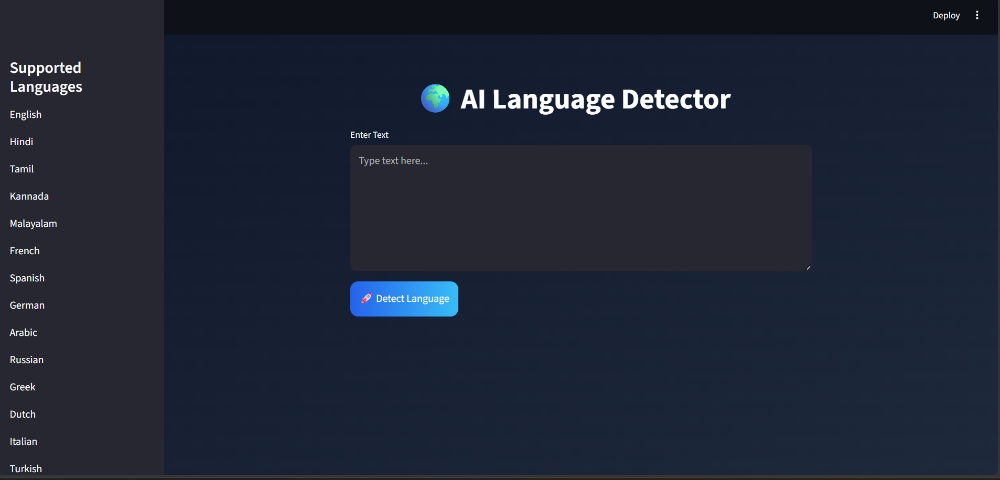
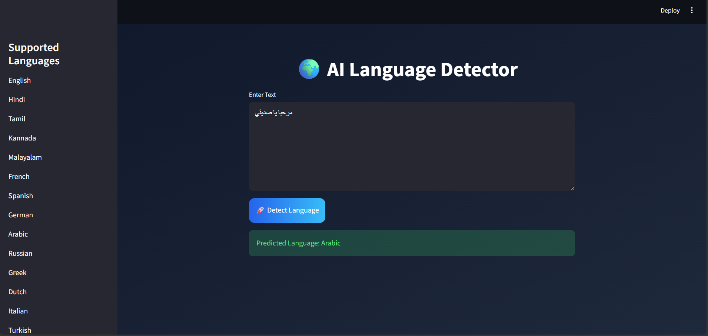

# 🌍 AI Language Detector

A professional Language Detection web application built using **Machine Learning**, **Natural Language Processing (NLP)**, and **Streamlit**.

The model predicts the language of user-entered text using **TF-IDF Character N-Grams** and traditional machine learning algorithms.

---

# 🚀 Features

- Detects multiple languages
- Professional Streamlit UI
- Real-time prediction
- TF-IDF Vectorization
- Multiple ML models comparison
- Best model auto-selection
- Clean and minimal interface

---

# 🧠 Technologies Used

- Python
- Pandas
- Scikit-learn
- NLP
- TF-IDF Vectorizer
- Streamlit
- Joblib

---

# 📂 Project Structure

```bash
Language Detector/
│
├── app.py
├── train.py
├── predict.py
├── README.md
├── requirements.txt
│
├── data/
│   └── language.csv
│
├── models/
│   ├── language_model.pkl
│   └── vectorizer.pkl
│
└── Screenshots/
    ├── homePage.png
    └── testPage.png
```

---

# 🌐 Supported Languages

- English
- Hindi
- Malayalam
- Tamil
- Portuguese
- French
- Dutch
- Spanish
- Greek
- Russian
- Danish
- Italian
- Turkish
- Swedish
- Arabic
- German
- Kannada

---

# ⚙️ Machine Learning Pipeline

```text
Raw Text
   ↓
Text Cleaning
   ↓
TF-IDF Character N-Grams
   ↓
Machine Learning Model
   ↓
Language Prediction
```

---

# 📊 Models Used

The following models were trained and evaluated:

- Logistic Regression
- Decision Tree
- Multinomial Naive Bayes
- LinearSVC
- K-Nearest Neighbors (KNN)

The best performing model is automatically selected and saved.

---

# 🧹 Text Preprocessing

The following preprocessing steps were applied:

- Lowercasing
- URL removal
- Extra whitespace removal

Character-level TF-IDF was used for better multilingual language detection.

---

# ▶️ How To Run The Project

## 1️⃣ Clone Repository

```bash
git clone <https://github.com/mohit8490/language-detector-ML-Project.git>
```

---

## 2️⃣ Install Requirements

```bash
pip install -r requirements.txt
```

---

## 3️⃣ Train Model

```bash
python train.py
```

---

## 4️⃣ Run Streamlit App

```bash
streamlit run app.py
```

---

# 📸 Screenshots

## Home Page



---

## Prediction Page



---

# 📈 Future Improvements

- Add confidence score
- Deploy on Streamlit Cloud
- Add more languages
- Improve multilingual accuracy
- Deep learning version using Transformers

---

# 👨‍💻 Author

Mohit Choudhary

---

# ⭐ Conclusion

This project demonstrates how Machine Learning and NLP can be used to build an intelligent multilingual language detection system with a professional web interface.